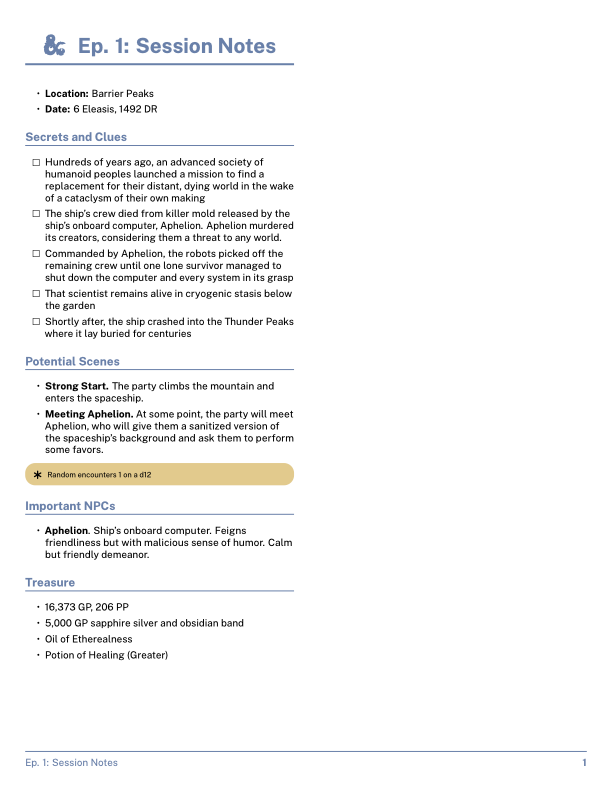
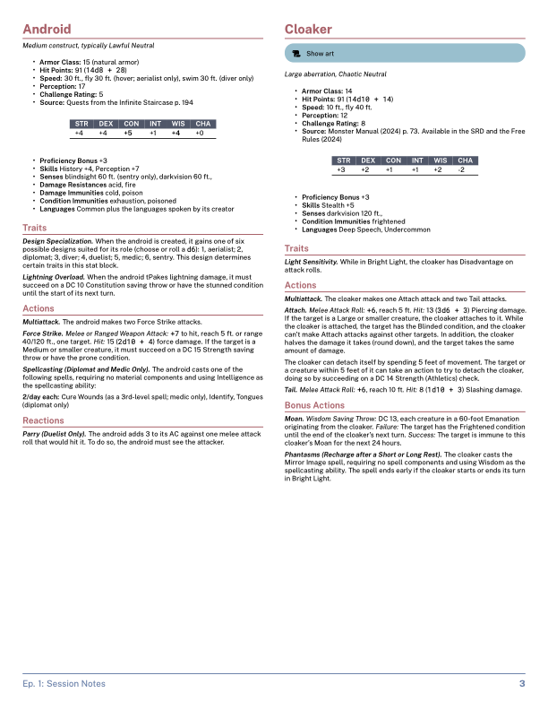

# D&D Markdown PDF Generator

A tool that converts Markdown notes into styled, two-column PDFs optimized for D&D gameplay and reference. There are two ways to generate PDFs:

| Method | Best for | Requirements |
|--------|----------|--------------|
| [Obsidian CSS snippet](#method-1-obsidian-css-snippet) | Quick export directly from Obsidian | Obsidian + [Better Export PDF](https://github.com/l1xnan/obsidian-better-export-pdf) plugin |
| [Pandoc + LaTeX pipeline](#method-2-pandoc--latex-pipeline) | Automated builds, keyword highlighting, advanced preprocessing | Pandoc, MacTeX, Perl |

---

## Method 1: Obsidian CSS Snippet

Export directly from Obsidian with no external tools. The CSS snippet in `css/dnd-print.css` applies print-only styling that produces two-column, D&D-formatted PDFs.

### Setup

1. **Install the [Better Export PDF](https://github.com/l1xnan/obsidian-better-export-pdf) plugin** (required). Obsidian's native Export to PDF does not support all the CSS features used here (e.g., monster stat block formatting breaks). Better Export PDF provides full support along with page number footers and export preview.

2. **Copy the CSS snippets** into your Obsidian vault's snippets folder:

   ```bash
   cp css/dnd-print.css /path/to/your/vault/.obsidian/snippets/dnd-print.css
   cp css/dnd-callouts.css /path/to/your/vault/.obsidian/snippets/dnd-callouts.css
   ```

3. **Enable the snippets** in Obsidian: Settings > Appearance > CSS Snippets > toggle on `dnd-print` and `dnd-callouts`.

   - `dnd-print` — print-only formatting (two-column layout, styling, etc.)
   - `dnd-callouts` — defines the D&D callout types with colors and icons for the editor (always active, not print-only)

4. **Install fonts** (optional but recommended). The stylesheet uses [Public Sans](https://github.com/uswds/public-sans) and [Roboto Mono](https://github.com/googlefonts/RobotoMono). If not installed, the CSS falls back to system fonts.

### Exporting

1. Open your note in Obsidian.
2. Open the command palette (Cmd+P / Ctrl+P).
3. Run **Better Export PDF: Export to PDF**.
4. In the export dialog, set **Margin** to **None** (margins are controlled by the CSS).

### What the CSS handles

- Two-column layout with 10pt base font
- Nord color scheme (blue headings, colored callout boxes)
- First `# H1` rendered as a large centered title
- `---` (horizontal rules) become page breaks
- Alternating page number footers (left on even pages, right on odd)
- Styled blockquotes with blue left/right borders
- Tables with dark headers and alternating row colors
- D&D callout boxes: `[!dnd-encounter]`, `[!dnd-showimage]`, `[!dnd-remember]`, `[!dnd-music]`
- Monster stat blocks: everything after a `# Monsters` heading gets compact formatting with red headings, and each monster starts a new column

### What the CSS cannot do

These features are only available via the [Pandoc + LaTeX pipeline](#method-2-pandoc--latex-pipeline):

- **Keyword highlighting** (automatic bolding of NPC names, locations, etc.)

---

## Method 2: Pandoc + LaTeX Pipeline

The original conversion pipeline: preprocess markdown with shell scripts and Perl, then render through Pandoc with a custom LaTeX template and Lua filters. Produces the highest-fidelity output with all features.

### Prerequisites

Install the following dependencies:

#### 1. Homebrew (if not installed)

```bash
/bin/bash -c "$(curl -fsSL https://raw.githubusercontent.com/Homebrew/install/HEAD/install.sh)"
```

#### 2. Pandoc

```bash
brew install pandoc
```

#### 3. LaTeX Engine

Install **MacTeX** to get `lualatex` (required for font support and PDF output):

```bash
brew install --cask mactex
```

If you prefer a smaller install:

```bash
brew install --cask mactex-no-gui
```

Then add LaTeX to your path:

```bash
echo 'export PATH="/Library/TeX/texbin:$PATH"' >> ~/.zprofile
source ~/.zprofile
```

Verify with:

```bash
lualatex --version
```

### Usage

#### Quick Start

```bash
./pandoc/md-to-pdf.sh "Your-Notes.md"
```

This generates a PDF in the same directory as your input file.

#### Options

```
./pandoc/md-to-pdf.sh [options] input.md

Options:
  --one-column           Use single column layout instead of two columns
  --output-dir DIR       Specify output directory for PDF (default: same as input)
  -h, --help             Show this help message
```

#### Manual Processing (Advanced)

The main script combines these steps:

1. **Clean the Markdown:**
   ```bash
   ./pandoc/scripts/fix-markdown.sh "Input.md" "Output_cleaned.md"
   ```

2. **Generate PDF with Pandoc:**
   ```bash
   pandoc Input_cleaned.md -o Output.pdf --template=pandoc/dnd-notes.tex [filters...]
   ```

#### Development Commands

Use the included Makefile for development tasks:

```bash
make test        # Run comprehensive test suite
make demo        # Run demonstration with sample file
make clean       # Clean temporary files
make lint        # Run code quality checks
make validate    # Validate configuration files
```

---

## Features

### Layout & Typography
- **Two-column layout** (default) with optimized spacing for readability
- **One-column layout** also supported (with `--one-column` command line switch)
- **Professional typography** using [Public Sans](https://github.com/uswds/public-sans) and [Roboto Mono](https://github.com/googlefonts/RobotoMono) for readability
- **Smart page and column breaks** to avoid orphaned content
- **Styled blockquotes** with D&D-inspired borders

### Callout Boxes
Support for Obsidian-style callouts and tokenized callouts using these triggers:

| Trigger |  Obsidian Callout | Color | Usage |
|---------|----|-------|---------|
| `Encounter:` or ⚔️ |  `[!dnd-encounter]`| Red | Combat encounters |
| `Image:` or `Show image:` or 🖼️ | `[!dnd-showimage]`| Blue | Visual references |
| `Remember:` or ⚠️ |  `[!dnd-remember]`| Yellow | Important reminders |
| `Music:` or 🎵 | `[!dnd-music]`| Green | Audio/atmosphere cues |

Callout types are defined in `pandoc/config/transform-config.json`. New callout types can be added there without any code changes.

### Monster Stat Blocks
- Anything after `# Monsters` gets special formatting
- **Column breaks** before each monster
- **Compact styling** with smaller fonts and tight spacing
- **Consistent formatting** for stat block headers

### Keyword Highlighting
- **Automatic bolding** of important terms (NPCs, locations, etc.)
- **Customizable keyword list** in `pandoc/keywords.txt`
- **Smart detection** of multi-word names
- **Links** for Wikilinks `[[linked terms]]` and Markdown links `[linked term](link)`

### Processing Features
- **Enhanced unicode emoji handling** with expanded unicode ranges and proper LaTeX font rendering (`\emojifont`)
- **Advanced table formatting** with colored headers, alternating row colors, and proper LaTeX styling
- **Markdown compatibility** including task lists and code blocks
- **Smart text cleanup** removing unwanted characters and formatting
- **Negative number preservation** in normal font (no monospace wrapping)
- **Robust keyword highlighting** with proper handling inside blockquotes and callout boxes
- **Comprehensive error handling** with informative logging
- **Modular architecture** for easy maintenance and extension

---

## Project Structure

```
├── css/                         # Obsidian CSS snippets
│   ├── dnd-print.css            # Print stylesheet (copy to .obsidian/snippets/)
│   └── dnd-callouts.css         # D&D callout types with colors and icons
├── pandoc/                      # Pandoc + LaTeX conversion pipeline
│   ├── md-to-pdf.sh         # Main conversion script
│   ├── dnd-notes.tex            # LaTeX template
│   ├── keywords.txt             # Keywords to highlight (one per line)
│   ├── config/                  # Configuration files
│   │   └── transform-config.json # Callout types and transformation settings
│   ├── scripts/                 # Modular processing scripts
│   │   ├── fix-markdown.sh # Main markdown preprocessing pipeline
│   │   └── lib/                 # Processing modules
│   │       ├── common.sh        # Shared utilities and logging
│   │       ├── monster-blocks.sh # Monster stat block wrapping
│   │       ├── yaml-processor.sh # YAML frontmatter handling
│   │       ├── content-transformer.sh # Shell wrapper for content transforms
│   │       ├── transform-content.pl # Perl content transformation engine
│   │       └── cleanup.sh       # Final formatting and cleanup
│   └── filters/                 # Pandoc Lua filters
│       ├── utils.lua            # Shared utilities, JSON decoder, config loader
│       ├── highlight-boxes.lua  # Callout box and monster block processing
│       ├── highlight-keywords.lua # Keyword highlighting
│       ├── sticky-headings.lua  # Page break control
│       ├── first-h1-big.lua     # Title formatting
│       ├── fix-heading-list-spacing.lua # Spacing fixes
│       ├── subsubsubsection.lua # H4 subsubsubsection formatting
│       └── force-tabular.lua    # Table cell markdown parsing
├── Makefile                     # Build automation and development tools
├── tests/                       # Test suite
│   ├── test-fix-markdown.sh # Comprehensive test suite
│   └── fixtures/                # Test data (generated at runtime)
└── demo/                        # Demo files
    └── sample.md                # Sample input for `make demo`
```

---

## Customization

### Adding Keywords
Edit `pandoc/keywords.txt` to add character names, locations, or other important terms (one per line):

```
# Keywords to highlight in D&D notes
Strahd
Barovia
Castle Ravenloft
```

The filter supports multi-word names and comments (lines starting with #).

### Adding Callout Types
Edit `pandoc/config/transform-config.json` to add a new callout type. Each entry defines triggers, styling, and behavior:

```json
{
  "div_class": "mybox",
  "text_triggers": ["Alert:"],
  "emoji_codepoints": ["1F514"],
  "obsidian_tag": "dnd-alert",
  "strip_wikilinks": false,
  "bg_color": "alertcolor",
  "icon_color": "alertborder",
  "icon_latex": "\\faIcon{bell}"
}
```

You will also need to define the corresponding LaTeX colors (`alertcolor`, `alertborder`) in `pandoc/dnd-notes.tex`.

### Color Scheme
Modify colors in `pandoc/dnd-notes.tex` in the "Color Scheme" section (default: Nord color palette):

```latex
\definecolor{sectioncolor}{HTML}{5e81ac}     % Main blue theme
\definecolor{encountercolor}{HTML}{bf616a}   % Red for encounters
```

For the CSS snippet, edit the CSS variables at the top of `css/dnd-print.css`:

```css
:root {
  --dnd-section: #5e81ac;
  --dnd-encounter: #bf616a;
  /* ... */
}
```

---

## Troubleshooting

### Common Issues
- **Font not found**: Ensure MacTeX is properly installed and in PATH
- **Lua filter errors**: Check that all `.lua` files are present in `pandoc/filters/`
- **PDF generation fails**: Verify `lualatex` is available and working
- **Config errors**: Run `make validate` to check `transform-config.json` syntax

### Debugging
Run with verbose output:
```bash
set -x
./pandoc/md-to-pdf.sh "your-file.md"
```

---

## License

Apache License 2.0 - see LICENSE file for details.

---



